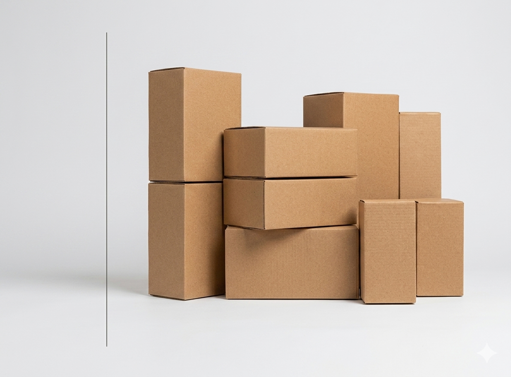
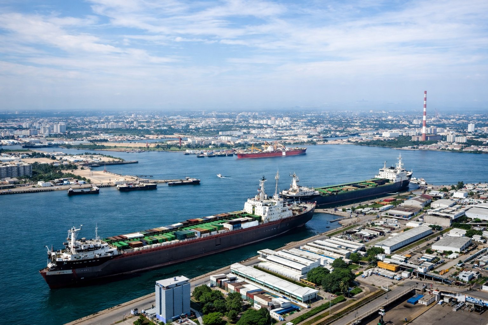
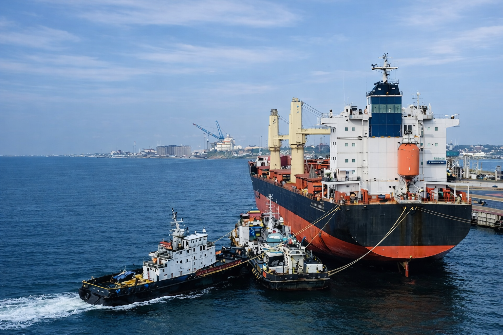

# IMAGES DISPONIBLES POUR LES PRODUITS
*Guide des images que vous pouvez utiliser*

---

## 🖼️ IMAGES ACTUELLEMENT DISPONIBLES

Dans votre dossier `images/`, vous avez :

### Images principales
- **`ava.png`** - Image pour service Avitaillement (986 KB)
- **`soutage.png`** - Image pour service Soutage (1.06 MB)  
- **`PRODUIT.png`** - Image produit par défaut (1.67 MB)
- **`about.png`** - Image section À Propos (2.66 MB)
- **`first.png`** - Image page d'accueil (2.33 MB)

### Dossiers thématiques
- **`images/logo/`** - Pour les logos
- **`images/contact/`** - Pour les images de contact
- **`images/produit/`** - Pour les images de produits
- **`images/services/`** - Pour les images de services

---

## 📋 EXEMPLES D'UTILISATION

### Pour les produits maritimes :
```html
<!-- Équipement de sécurité -->


<!-- Carburant et énergie -->


<!-- Produits techniques -->


<!-- Navigation et équipement -->


<!-- Services généraux -->

```

---

## 🎯 PRODUITS PAR DÉFAUT AVEC IMAGES VARIÉES

1. **Corde Marine Premium** → `ava.png`
2. **Gilet de Sauvetage** → `soutage.png`  
3. **Kit de Réparation Coque** → `about.png`
4. **Bouée de Sauvetage** → `first.png`
5. **Lampe de Poche Étanche** → `PRODUIT.png`
6. **Kit Nettoyage Pont** → `ava.png`

---

## 💡 CONSEILS POUR AJOUTER DE NOUVELLES IMAGES

### Si vous voulez ajouter vos propres images :

1. **Préparez l'image** :
   - Format : PNG, JPG ou WEBP
   - Taille : moins de 2 Mo
   - Nom simple : pas d'espaces

2. **Placez l'image** dans le bon dossier :
   ```
   images/
   ├── nouvelle-image.png
   ├── autre-produit.jpg
   └── services/
       └── service-specifique.png
   ```

3. **Utilisez l'image** dans Supabase :
   ```
   nom: "Votre Nouveau Produit"
   description: "Description du produit"
   prix: 15000
   image: "nouvelle-image.png"
   ```

---

## 🔄 COMMENT CHANGER L'IMAGE D'UN PRODUIT

### Dans Supabase :
1. Allez dans la table `produits`
2. Modifiez le champ `image`
3. Changez `"PRODUIT.png"` par `"ava.png"` ou autre

### Dans l'admin local :
1. Modifiez le produit
2. Changez le nom de l'image
3. Sauvegardez

---

## 📊 RÉCAPITULATIF DES IMAGES

| Image | Taille | Usage recommandé |
|-------|--------|----------------|
| `ava.png` | 986 KB | Équipement, services |
| `soutage.png` | 1.06 MB | Carburant, énergie |
| `PRODUIT.png` | 1.67 MB | Produits techniques |
| `about.png` | 2.66 MB | Navigation, équipement lourd |
| `first.png` | 2.33 MB | Services généraux |

---

## 🎨 POUR ALLER PLUS LOIN

### Créer des sous-dossiers organisés :
```
images/
├── produits/
│   ├── cordes.png
│   ├── gilets.png
│   └── lampes.png
├── services/
│   ├── avitaillement.png
│   └── soutage.png
└── logo/
    └── logo-FIRST-SERVICE.png
```

### Utiliser des images spécifiques :
- `images/produits/corde-marine.png`
- `images/produits/gilet-sauvetage.png`
- `images/services/avitaillement-complet.png`

*Ceci vous donne une bonne base pour varier les visuels de vos produits !*
